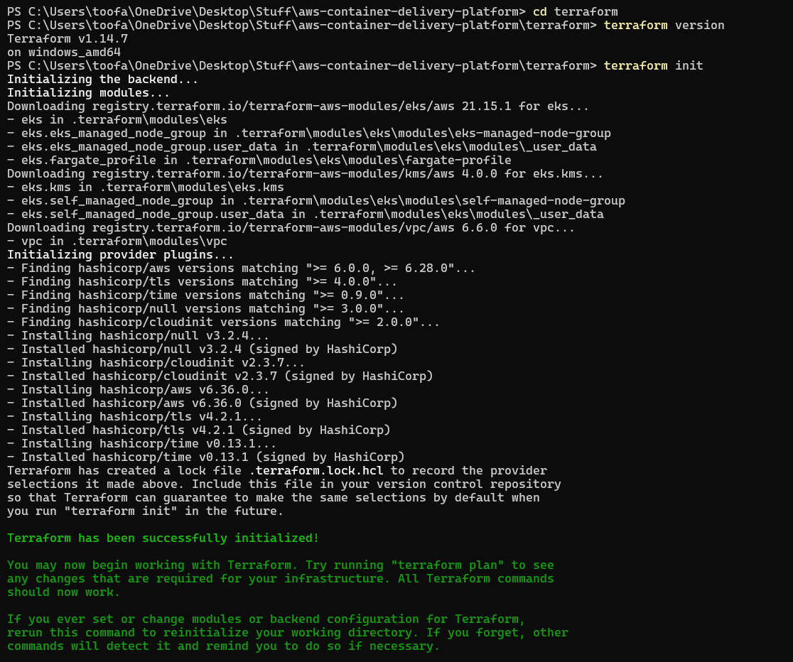
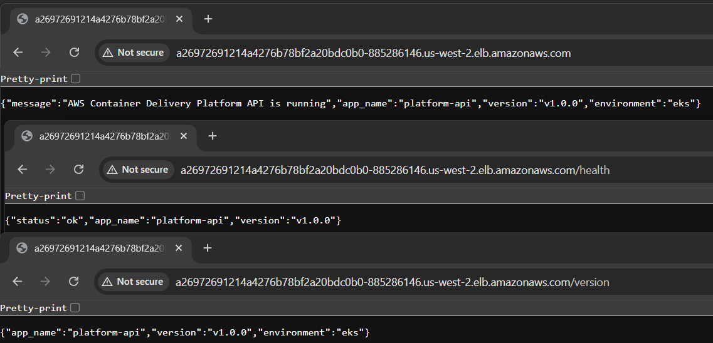

# AWS Container Delivery Platform

> Production-style container platform built on AWS using **FastAPI, Docker, Terraform, Amazon EKS, Kubernetes, and GitHub Actions**.

This project demonstrates an end-to-end cloud deployment workflow: building a containerized API, pushing it to Amazon ECR, provisioning infrastructure with Terraform, deploying to Amazon EKS, enabling autoscaling, automating delivery with CI/CD, and troubleshooting real infrastructure issues along the way.

---

## Project Overview

The goal of this project was to simulate a realistic DevOps deployment pipeline rather than just run a container locally.

The platform includes:

- Docker-based containerization
- Amazon ECR image storage
- Terraform-based AWS infrastructure provisioning
- Amazon EKS Kubernetes deployment
- Kubernetes LoadBalancer exposure
- Horizontal Pod Autoscaling
- GitHub Actions CI/CD
- infrastructure debugging and teardown

---

## Tech Stack

### Cloud

- AWS EKS
- AWS ECR
- AWS VPC
- AWS IAM
- Elastic Load Balancing

### Infrastructure as Code

- Terraform

### Containers / Orchestration

- Docker
- Kubernetes

### Application

- Python
- FastAPI
- Uvicorn

### CI/CD

- GitHub Actions

---

## Architecture Summary

High-level workflow:

1. Build FastAPI application
2. Containerize application with Docker
3. Push image to Amazon ECR
4. Provision AWS infrastructure with Terraform
5. Deploy workload to Amazon EKS
6. Expose the application with a Kubernetes LoadBalancer Service
7. Enable Horizontal Pod Autoscaling
8. Automate deployment with GitHub Actions
9. Validate the platform and destroy infrastructure after testing

---

## Repository Structure

```text
aws-container-delivery-platform
├── app
│   ├── __init__.py
│   ├── main.py
│   ├── requirements.txt
│   ├── Dockerfile
│   └── tests
│       └── test_main.py
├── k8s
│   ├── namespace.yaml
│   ├── deployment.yaml
│   ├── service.yaml
│   ├── hpa.yaml
│   ├── ingress.yaml
│   ├── configmap.yaml
│   └── secret.example.yaml
├── terraform
│   ├── main.tf
│   ├── providers.tf
│   ├── outputs.tf
│   ├── variables.tf
│   ├── versions.tf
│   └── terraform.tfvars.example
├── .github
│   └── workflows
│       └── deploy.yml
├── docs
│   └── screenshots
└── README.md
```

---

## Key Implementation Steps

### 1. Built and tested the FastAPI application

Created a lightweight API with /, /health, and /version endpoints to make validation easy across local development, Docker, and Kubernetes deployment stages.

### 2. Containerized the application with Docker

Built and tested the FastAPI app locally in a Docker container before moving into AWS deployment.

### 3. Pushed the image to Amazon ECR

Created an ECR repository, authenticated Docker, tagged the image, and pushed it successfully.

### 4. Provisioned AWS infrastructure with Terraform

Used Terraform to provision:

- VPC
- public and private subnets
- internet gateway
- NAT gateway
- security groups
- Amazon EKS cluster
- managed node group

### 5. Debugged an EKS node initialization failure

The worker node group initially failed because the AWS VPC CNI networking component was not initialized correctly before compute came online.

This caused the node to remain NotReady with a networking-related error. After correcting the cluster addon/dependency setup, the node joined successfully and the cluster became healthy.

### 6. Deployed the application to Kubernetes

Created Kubernetes manifests for:

- Namespace
- Deployment
- Service

The application was exposed publicly through an AWS load balancer.

### 7. Added Horizontal Pod Autoscaling

Installed Metrics Server and configured an HPA to scale the deployment based on CPU utilization.

### 8. Added GitHub Actions CI/CD

Created a workflow to:

- run tests
- build the Docker image
- push the image to ECR
- update the Kubernetes deployment

### 9. Validated and destroyed infrastructure

After verifying the platform end to end, all AWS infrastructure was destroyed to avoid ongoing cost.

---

## Featured Screenshots

- Public application endpoint running from EKS
- GitHub Actions CI/CD deployment success

More deployment evidence is available in `docs/screenshots/`.

---

## Troubleshooting Highlights

This project included real infrastructure debugging, not just a happy-path deployment.

### EKS node group failure

The node group initially failed because the cluster networking plugin was not available in the correct initialization order. This caused the worker node to remain NotReady.

### Autoscaling prerequisites

Horizontal Pod Autoscaling required Metrics Server before usage metrics became available.

### Terraform destroy blocked by Kubernetes-created ELB

During teardown, Terraform initially stalled because a Kubernetes-created Classic Load Balancer still had requester-managed network interfaces attached. After identifying and removing the lingering ELB, the destroy process completed successfully.

---

## What This Project Demonstrates

- AWS infrastructure provisioning with Terraform
- containerization with Docker
- Amazon ECR workflows
- Kubernetes deployment to Amazon EKS
- public application exposure with LoadBalancer Services
- Horizontal Pod Autoscaling
- GitHub Actions CI/CD
- infrastructure troubleshooting
- responsible cloud cost management through teardown

---

## Screenshots

Project screenshots are stored in:

`docs/screenshots`

They document:

- local testing
- Docker validation
- ECR push
- Terraform provisioning
- EKS debugging
- Kubernetes deployment
- HPA scaling
- GitHub Actions CI/CD
- final validation
- infrastructure teardown

---




---

## Resume-Relevant Highlights

- Built and deployed a containerized FastAPI application to Amazon EKS using Terraform, Docker, Kubernetes, and GitHub Actions
- Implemented Horizontal Pod Autoscaling based on resource utilization
- Diagnosed and resolved an EKS node initialization failure caused by networking addon timing
- Automated container delivery with CI/CD
- Validated and destroyed AWS infrastructure after testing to control cost

---

## Author

**Steven Pham**  
B.S. Computer Science, California State University Dominguez Hills  
AWS Certified Cloud Practitioner  
AWS Certified Solutions Architect – Associate
